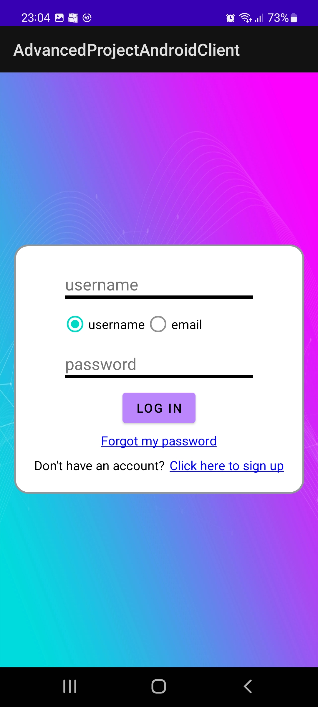
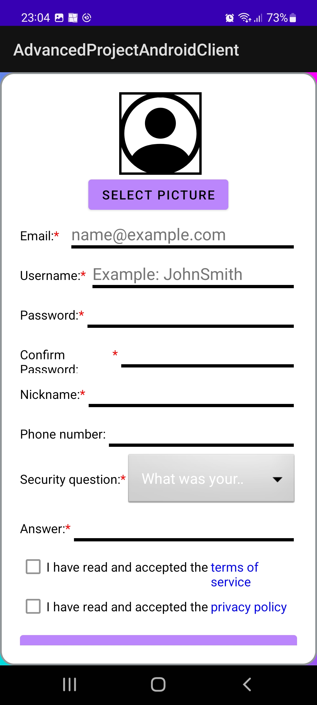
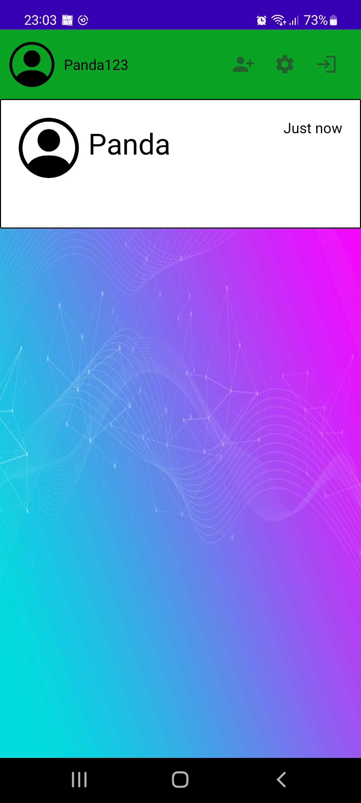
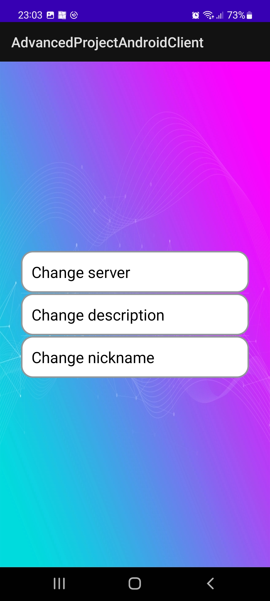
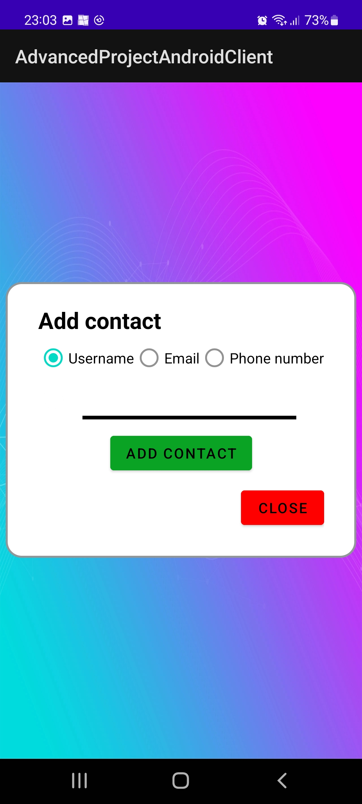
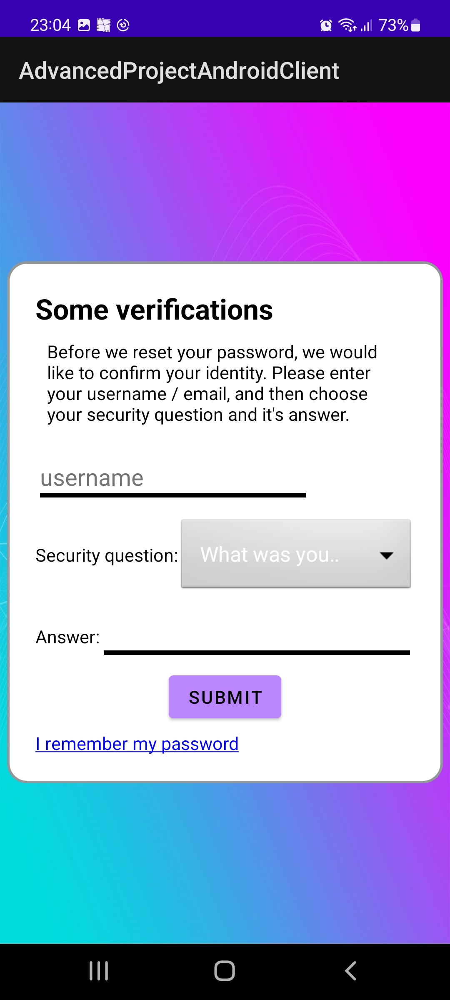
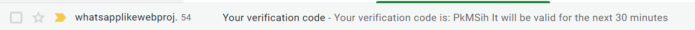

# `Submitted by:`
Yuval Uner, Github: OddPanda.\
Nadav Elgrabli, Github: ZycleXx.\
IDs were removed as the repository is now public and are now only in the file submitted via moodle.

# `Dependencies:`
All dependencies are included in the gradle build file.
1. com.google.firebase:firebase-core:17.2.1
2. com.google.firebase:firebase-messaging:20.0.0
3. androidx.room:room-common:2.4.2
4. androidx.room:room-runtime:2.4.2
5. androidx.room:room-compiler:2.4.2
6. com.squareup.retrofit2:retrofit:2.9.0
7. com.squareup.retrofit2:converter-gson:2.9.0
8. com.google.code.gson:gson:2.9.0
9. androidx.appcompat:appcompat:1.4.2
10. com.google.android.material:material:1.6.1
11. androidx.constraintlayout:constraintlayout:2.1.4

# `How to run:`
To run the app via Android Studio, open the project in Android Studio
and click on the Run button with any device running API level 26 and above.

### `Remote server configuration`
We've set up a remote server by following the instructions.\
In the strings.xml file, the url is listed in the string called "base_url".\
If you wish to test against that, simply keep it as is.\
So long as the server did not die for unforeseen circumstances (which can happen,
it is well known that all bugs that a developer never saw coming during
testing and development happen in production), it should work.\
If it did crash, it should be fairly obvious as creating users and logging in will not function.

Assuming the server did / does crash, and that you have access to to individual user's directories on the university servers,
the server is under the user "uneryuv" in the AspDotNetServer folder.\
Otherwise, please use the local server configuration as listed below.

Do note however that firebase notifications, email sending and live message updates
(as that relied on firebase, because it was not stated whether we can use SignalR for android)
do not work via the remote server.\
This is likely due to some firewall rules on vpn set up by the university, and
we have no way to figure out how to fix it (nor likely the ability to).

However, it does work, and video proof of it when running on a testing environment
on a physical android device is provided at the bottom of this README.

Code for it can also be found in the transfer controller of the server (https://github.com/CulturedPanda/AdvancedProgrammingProjectsServer),
as well as in the Android app in the services package -> FirebaseService.

### `Local server configuration`
Using the server from the 2nd assignment (link to Github repository above) and running it on a local
environment is also possible.
To do this, change the base_url in the strings.xml file to the local server's url.\
If the android device used for testing is an emulator, setting it to http://10.0.2.2:{server port}/api/ should work.

In case a proxy is needed to get the messages to the server (as testing environment tends to block requests outside localhost),
the following is one way to set up such a proxy:
1. In visual studio with the server project open, go to AdvancedProjectWebApi -> Properties ->
   Debug -> Open launch debug profiles UI -> IISExpress.
2. Set Use SSL to false.
3. Switch the project startup setup to IISExpress.
4. If NPM is not installed, install it.
5. Run npm install -g iisexpress-proxy.
6. Run iisexpress-proxy {server port} to {proxy port}.
7. Set the base_url in strings.xml to http://{ip of computer running the server}:{proxy port}/api/.

After doing this and running the server, everything should work (including firebase notifications and email sending).

This is just one possible way to set up the local server for devices on the network.\
Other ways may be using ngrok, etc.

# `The application itself:`

First, do note that the code is pretty much a complete mess.
This was basically just a mixture of being a rush job as well as not knowing how to actually
do multithreading in Java properly, leading to complete abuse of MutableLiveData where futures should have been
used, leading to some code that may be hard to figure out, and fairly full of bad practices.

## `The activities:`

### `Log in activity`
The log in activity is the first activity that is shown to the user.

It is a simple activity, allowing for logging in with a username and password, or with the email instead
of the username.\
In addition, it contains links to the registration activity and the forgot password activity.\
The user will be automatically logged in if they have a valid refresh token.

### `Registration activity`
Just as its name states, this activity is for registering a new user.

The user can choose their profile picture (stored locally only), their email, username, etc.\
After registering, the user is moved to the verify email activity.\
You can input "111111" as the verification code to bypass that mechanic.

### `Contacts screen`
This activity is the main activity of the app.\
It displays all the user's contacts, and allows for opening the chat with them.\
It also contains links to the options and add contact activities, as well as a log-out button.

### `Options activity`
This activity is for changing the user's settings.\
It allow for changing the user's nickname, server and description.\
Screenshots of the individual options were not shown.

### `Add contact activity`
This activity is for adding a new contact.\
It allows the user to add a contact via either their username, their email or their phone number.\
After succesfully adding a contact, they will be shown in the user's contact list.

### `Forgot password activity`
This activity is for resetting the user's password.\
It is a 3-step process (only 1st step's image is shown here).\
The user is first asked to verify their username + security question, followed by verifying their email
via a code sent to it, and then finally choosing their new password.

## `Proof of working notifications and live messaging`
The following is a video proof of the notifications and live messaging functionality.\
As soon as a message was sent from a web client, a notification was received on the device (note the time matches, 19:54).\
In addition, once the web client sent a new message while inside the chat, the chat was updated automatically.\
The chat's automatic updates are done when getting the notification from firebase (as it was unclear whether usage of
SignalR for android was allowed on android), therefore it does not work when running the server on the university's server.

While video proof was not provided of it working when the app is in the background as well, It does actually work, and this can be
tested by running the server on a local environment and not the one on the university server, as explained above.

Also note that this is a gif, so it loops in the end - the messages are not deleted, it simply loops back to the beginning,
where there were still no messages.

## `Proof of working email sending`
While this was not mandatory, this also works on our local environment, as can be seen by the many
emails I got while testing.\
This only not working on the remote environment is also likely due to firewall rules.

